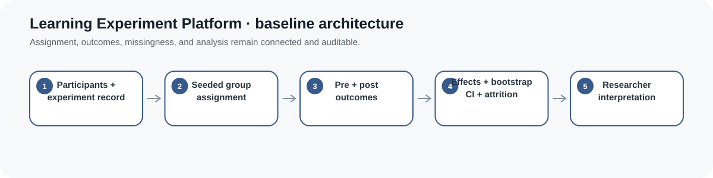
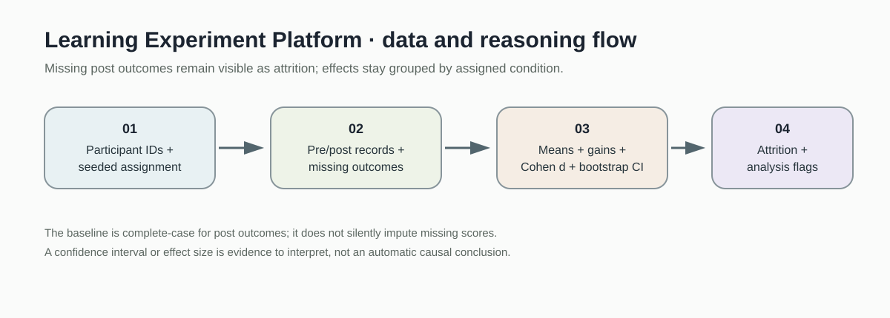
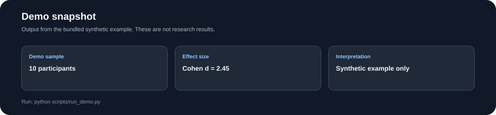
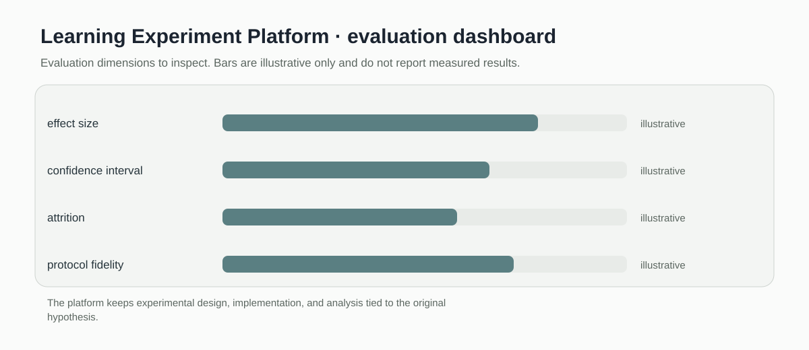

# Learning Experiment Platform

> Small reproducible experiment scaffold for random assignment, pre and post gains, and Cohen d effect size.

[](https://github.com/devissaputra/learning-experiment-platform/actions/workflows/ci.yml)



**Area:** Instructional Design & Curriculum Intelligence    
**Status:** working research prototype  
**Author:** Devis Wawan Saputra

## What this project is for

This is a small experiment framework for learning design interventions. The current baseline provides seeded assignment, paired gain calculations, and Cohen d so the core design and effect calculation remain easy to reproduce and inspect. Attrition handling and uncertainty estimation are future additions.

**Who may find it useful:** Learning scientists, instructional designers, and L&D researchers running A/B or quasi-experimental studies.

## Research questions

1. What is the estimated learning effect of a design intervention?
2. Are observed effects practically meaningful as well as statistically distinguishable?
3. How do attrition and imbalance change interpretation?

## How it works

The baseline provides three small pieces that are easy to verify: seeded participant assignment, pooled standard deviation Cohen d for two groups, and paired post minus pre gain scores. It does not yet calculate confidence intervals or attrition adjustments.



A hypothesis leads to participant assignment and outcome collection, then the current code supports effect size and gain calculations. Protocol fidelity and uncertainty analysis remain explicit next steps.



This snapshot shows the bundled synthetic example for Learning Experiment Platform. It checks the software path; it is not an empirical performance result.

## Methods in the current baseline

- seeded random assignment
- group mean calculation
- pooled Cohen d
- paired gain scores
- synthetic experiment demo

## Data

Synthetic experimental data are included.

`data/README.md` documents the sample schema and the conditions that should be recorded before any real dataset is connected. Restricted or identifiable learner data should stay outside the repository.

## Run the demo

```bash
git clone https://github.com/devissaputra/learning-experiment-platform.git
cd learning-experiment-platform
python scripts/run_demo.py
python -m unittest discover -s tests -v
```

The demo creates a reproducible ten person assignment and calculates Cohen d from synthetic group outcomes. The printed value is a software demonstration, not an empirical effect.

## What to evaluate next

The next version should add confidence intervals, missing outcome handling, and a pre specified analysis record. It should then be tested on a small open experiment dataset where the expected analysis can be reproduced.

## Evaluation view



The Learning Experiment Platform dashboard is an evaluation checklist rather than a result chart. The bars are illustrative only; the labels show the evidence a real study would need to collect.

## Limits and responsible use

The code does not protect a study from bad randomization, selective outcome reporting, noncompliance, or weak measurement. It is an analysis scaffold, not an experiment management system. See `docs/ethics_and_risks.md` for the broader risk review.

## Repository map

```text
.
├── .github/workflows/ci.yml
├── assets/
│   ├── architecture.svg
│   ├── data_flow.svg
│   ├── demo_snapshot.svg
│   └── evaluation_dashboard.svg
├── data/
│   ├── README.md
│   └── sample.csv
├── docs/
│   ├── ethics_and_risks.md
│   ├── related_work.md
│   └── research_protocol.md
├── reports/model_card.md
├── scripts/run_demo.py
├── src/learning_experiment_platform/core.py
├── tests/test_core.py
├── CITATION.cff
├── LICENSE
├── pyproject.toml
└── README.md
```

## Research path

A credible next version would:

1. add bootstrap or analytic confidence intervals
2. record attrition and protocol deviations explicitly
3. reproduce one public learning experiment from raw data to reported effect

## Related work

`docs/related_work.md` points to open projects that are relevant to this problem area. They are context for comparison and study design; this repository does not present their code as its own.

## Citation and license

`CITATION.cff` contains the software citation. The code and original SVG visuals use the MIT License. Any external dataset keeps its own license and usage conditions.
