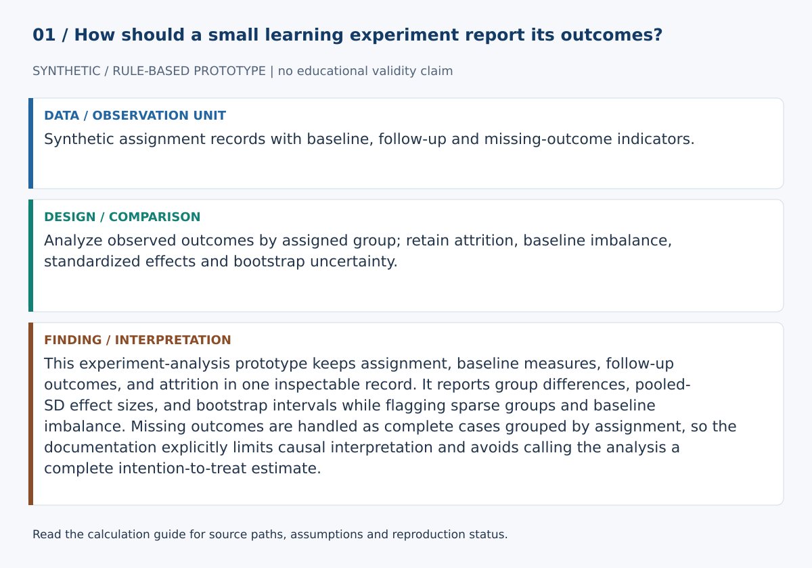
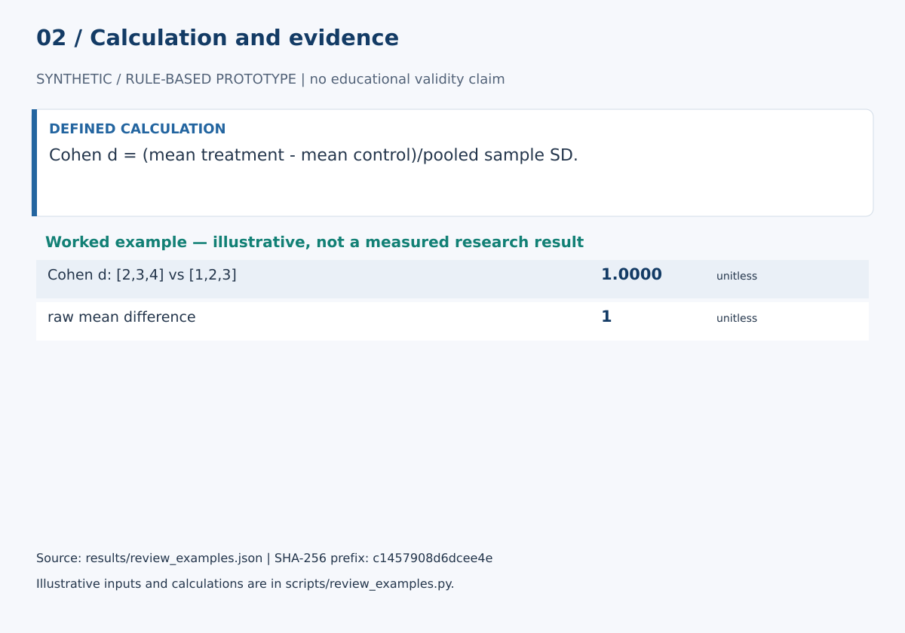

# Learning Experiment Platform

This experiment-analysis prototype keeps assignment, baseline measures, follow-up outcomes, and attrition in one inspectable record. It reports group differences, pooled-SD effect sizes, and bootstrap intervals while flagging sparse groups and baseline imbalance. Missing outcomes are handled as complete cases grouped by assignment, so the documentation explicitly limits causal interpretation and avoids calling the analysis a complete intention-to-treat estimate.

## Start here

- [Calculations, evidence and verification scope](CALCULATIONS.md)
- [Figure sources and exact numerical paths](docs/figure_spec.json)
- [Data status](data/README.md)





**Review scope:** 25 existing unittest checks passed. The bundled demonstration executed successfully in this review.

## Detailed project documentation

> Reproducible two-group learning experiments with seeded assignment, pre/post analysis, effect sizes, bootstrap uncertainty, and attrition review.

[](https://github.com/devissaputra/learning_experiment_platform/actions/workflows/ci.yml)


**Area:** AI in Education (AIEd) · Learning Science & Experimental Design  
**Status:** working research prototype  
**Author:** Devis Saputra

## What this project is for

Learning interventions should be evaluated with a workflow that keeps assignment, outcomes, missingness, and analysis decisions visible.

This repository provides a small dependency-free baseline for two-group pre/post learning experiments. It connects seeded assignment to participant outcomes, summarizes baseline and post-test performance, calculates gain scores and effect sizes, reports bootstrap uncertainty, and surfaces attrition for review.

**Who may find it useful:** learning scientists, instructional designers, L&D researchers, and AIEd researchers building small randomized pilots or reproducible experiment prototypes.

## Research questions

1. What is the treatment-minus-control difference in the primary learning outcome?
2. How do baseline differences and gain scores affect interpretation?
3. What uncertainty surrounds the observed mean difference?
4. How much attrition occurs in each assigned group?
5. Which missing-data or protocol issues should be reviewed before interpreting the result?

## End-to-end workflow

The demo now uses one connected path:

1. define participant IDs
2. create a seeded treatment/control assignment
3. attach pre and post outcomes to those assigned participants
4. preserve missing post outcomes as attrition
5. calculate baseline, post, and gain summaries
6. calculate raw mean differences and Cohen d when estimable
7. bootstrap confidence intervals for raw mean differences
8. surface analysis flags for human review


The code does not convert this workflow into an automatic causal claim.

## Current methods

- seeded two-group random assignment
- balanced group allocation with size difference at most one
- finite numeric input validation
- paired post-minus-pre gain scores
- baseline, post, and gain means by assigned group
- treatment-minus-control raw mean differences
- pooled-SD Cohen d
- explicit not-estimable effect-size states
- seeded percentile-bootstrap confidence intervals
- group-specific and overall attrition
- differential-attrition review signal
- baseline-imbalance review signal
- compact serializable experiment record
- integrated `analyze_experiment()` workflow

## Why assignment and analysis stay connected

The original prototype demonstrated randomization and effect-size calculation on unrelated arrays. The current version removes that gap.

The same participant assignment now feeds the records analyzed by `analyze_experiment()`.

Participants remain grouped by **assigned group**. A missing post outcome is counted as attrition rather than silently disappearing from the experiment record.

## Missing outcomes

The current baseline uses a transparent complete-case outcome analysis:

- assigned counts are preserved
- missing post outcomes are counted as attrition
- no post score is imputed
- post and gain estimates use observed outcomes

This is deliberately simple and should not be presented as a complete missing-data strategy.

## Effect sizes

`cohens_d()` reports the treatment-minus-control mean difference in pooled-standard-deviation units.

If the pooled standard deviation is zero, Cohen d is returned as **not estimable**. The code does not return zero merely because the denominator cannot be calculated.

For small-sample empirical research, a bias-corrected effect such as Hedges g may be preferable; that extension is not yet implemented.

## Uncertainty

The baseline reports seeded percentile-bootstrap confidence intervals for:

- post-test mean difference
- gain-score mean difference

The current version does not provide p-values, model-based standard errors, cluster-robust inference, or confidence intervals for Cohen d.

## Experiment record

`experiment_record()` stores:

- experiment ID
- hypothesis
- primary outcome
- assignment seed
- exclusion rule
- analysis method

See `docs/experiment_record_example.json`.

This local metadata supports reproducibility. It is **not** a substitute for an external time-stamped preregistration.

## Synthetic demo


The bundled example contains 12 synthetic participants, a seeded 6/6 assignment, and one intentionally missing control post-test outcome so the attrition path is exercised.

The values are software demonstrations, not empirical evidence that an intervention works.

## Data

`data/sample.csv` contains the same synthetic experiment structure used to document the repository schema.

`data/README.md` explains assignment provenance, missing-outcome semantics, minimum experiment metadata, and data-governance expectations.

## Run the demo

```bash
git clone https://github.com/devissaputra/learning_experiment_platform.git
cd learning_experiment_platform
python scripts/run_demo.py
python -m unittest discover -s tests -v
```

The current baseline uses only the Python standard library.

## Core API

`assign(ids, seed=42)` creates a reproducible two-group assignment.

`gain(post, pre)` returns paired post-minus-pre scores.

`cohens_d(treatment, control)` calculates the pooled-SD standardized mean difference and returns `None` when the denominator is not estimable.

`bootstrap_mean_difference_ci(...)` returns a seeded percentile-bootstrap confidence interval for a raw mean difference.

`experiment_record(...)` creates a compact serializable experiment-analysis record.

`analyze_experiment(records, ...)` runs the integrated pre/post analysis, attrition summary, effect calculations, confidence intervals, and review flags.

## Evaluation view


The evaluation graphic shows what a real validation study should inspect. Its bars are illustrative; they are not measured research results.

## Limits and responsible use

This repository does not protect a study from:

- weak measurement
- poor recruitment
- inadequate sample size
- treatment contamination
- noncompliance
- interference between participants
- selective outcome reporting
- post hoc exclusions
- cluster structure
- inappropriate causal interpretation

It does not currently implement quasi-experimental identification, cluster randomization, covariate-adjusted models, missing-data imputation, or causal estimators for noncompliance.

See `docs/ethics_and_risks.md` for experiment-specific ethical and misuse risks.

## Repository map

```text
.
├── .github/workflows/ci.yml
├── assets/
│   ├── architecture.svg
│   ├── data_flow.svg
│   ├── demo_snapshot.svg
│   └── evaluation_dashboard.svg
├── data/
│   ├── README.md
│   └── sample.csv
├── docs/
│   ├── ethics_and_risks.md
│   ├── experiment_record_example.json
│   ├── related_work.md
│   └── research_protocol.md
├── reports/model_card.md
├── scripts/run_demo.py
├── src/learning_experiment_platform/core.py
├── tests/test_core.py
├── .gitignore
├── CITATION.cff
├── LICENSE
├── pyproject.toml
└── README.md
```

## Research path

A stronger empirical version would:

1. reproduce a public learning experiment from raw data to reported estimates
2. add Hedges g and effect-size uncertainty
3. add explicit missing-data sensitivity analyses
4. support covariate-adjusted estimates
5. support cluster-randomized designs where relevant
6. compare outputs with established statistical software
7. connect analysis records to a formal preregistration workflow

## Related work

`docs/related_work.md` links the implementation to standardized mean-difference references, bootstrap/uncertainty context, preregistration practice, and randomized-trial reporting.

## Citation and license

`CITATION.cff` contains the software citation. Code and original SVG visuals use the MIT License. External datasets retain their own licenses, governance requirements, and ethics constraints.
